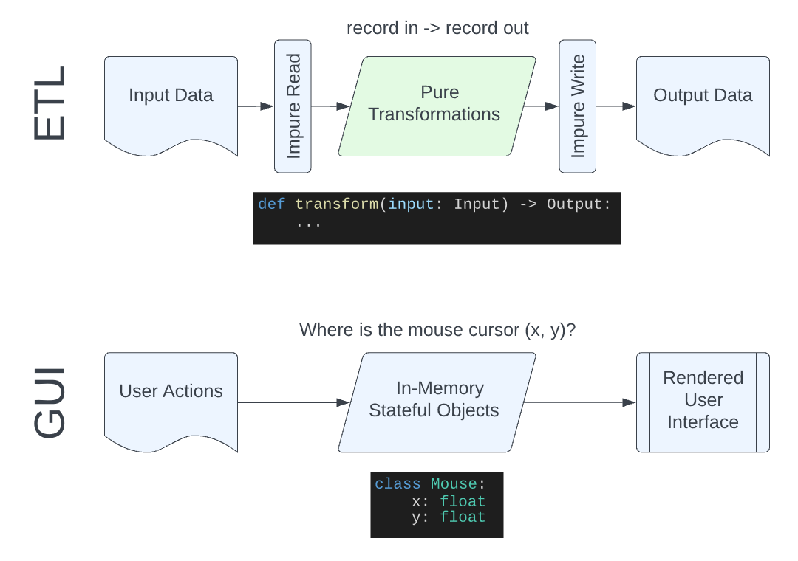

# Programming Styles

Python is considered a multi-paradigm language, supporting object-oriented, procedural and functional programming styles.

This workshop won't cover the general differences between _all_ of these styles, but for more information, see:

- [Python Programming Styles](https://newrelic.com/blog/nerd-life/python-programming-styles)
- [Perceiving Python Programming Paradigms](https://opensource.com/article/19/10/python-programming-paradigms)
- [Programming Paradigms in Python](https://www.geeksforgeeks.org/programming-paradigms-in-python/)


Instead, we'll focus on the differences between overarching ways to structure code in Python: through functions or objects.

Throughout this topic, we'll use two different implementations of a distance calculation formula as our example:

- **Haversine**: essentially treats the Earth as a sphere, calculates distance "as the crow flies".  Accurate, but computationally expensive (relatively speaking). 
- **Equirectangular Approximation**: essentially treats the Earth as a flat surface and uses the Pythagorean theorem to calculate distance.  Inaccurate over long distances, but computationally cheap.

The implementations of each in Python are provided below when needed.  For more on these formulas, [see this website](https://www.movable-type.co.uk/scripts/latlong.html).

## Functional Approach

To implement the distance calculators as functions, we could do the following:

```py
from typing import Protocol
from math import radians, cos, sin, asin, sqrt, degrees, pi, atan2
from .coordinates import Coordinates

class DistanceCalculator(Protocol):
    def __call__(self, p1: Coordinates, p2: Coordinates, earth_radius_km: float = 6371.0088) -> float:
        ...

def calculate_distance_haversine(p1: Coordinates, p2: Coordinates, earth_radius_km: float = 6371.0088) -> float:
    lat1 = radians(p1.latitude)
    lng1 = radians(p1.longitude)
    lat2 = radians(p2.latitude)
    lng2 = radians(p2.longitude)

    lat = lat2 - lat1
    lng = lng2 - lng1
    a = sin(lat * 0.5) ** 2 + cos(lat1) * cos(lat2) * sin(lng * 0.5) ** 2

    c = 2 * atan2(sqrt(a), sqrt(1-a))
    d = earth_radius_km * c
    return d

def calculate_distance_equirectangular(p1: Coordinates, p2: Coordinates, earth_radius_km: float = 6371.0088) -> float:
    lat1 = radians(p1.latitude)
    lng1 = radians(p1.longitude)
    lat2 = radians(p2.latitude)
    lng2 = radians(p2.longitude)

    x = lng2 - lng1 * cos((lat1 + lat2) / 2)
    y = lat2 - lat1
    d = sqrt(x * x + y * y) * earth_radius_km
    return d
```

## Partial Application / Factory Function Approach

The above approach is great in isolation.  But suppose we had additional requirements to support distance calculators from APIs, say [Microsoft's Bing Maps route API](https://docs.microsoft.com/en-us/bingmaps/rest-services/routes/calculate-a-route).  There's a slight problem with the above approach: 
- The signature for distance calculation includes `earth_radius_km`.
- While this was a reasonable abstraction when all our calculators needed that data, web distance calculators won't need it.
- Further, they'll likely need their own parameters, like API credential information.

How can we do this with a functional approach?  The signature we _want_ looks like:

```py
class DistanceCalculator(Protocol):
    def __call__(self, p1: Coordinates, p2: Coordinates) -> float:
        ...
```

But we need to allow for data to parameterize the behavior of that function.  To do that, we can take advantage of declaring nested functions to create a function we return:

```py
from typing import Protocol
from math import radians, cos, sin, asin, sqrt, degrees, pi, atan2
from .coordinates import Coordinates

class DistanceCalculator(Protocol):
    def __call__(self, p1: Coordinates, p2: Coordinates) -> float:
        ...

def haversine(earth_radius_km: float = 6371.0088) -> DistanceCalculator:
    def calculate(p1: Coordinates, p2: Coordinates) -> float:
        lat1 = radians(p1.latitude)
        lng1 = radians(p1.longitude)
        lat2 = radians(p2.latitude)
        lng2 = radians(p2.longitude)

        lat = lat2 - lat1
        lng = lng2 - lng1
        a = sin(lat * 0.5) ** 2 + cos(lat1) * cos(lat2) * sin(lng * 0.5) ** 2

        c = 2 * atan2(sqrt(a), sqrt(1-a))
        d = earth_radius_km * c
        return d
    
    return calculate

def equirectangular(earth_radius_km: float = 6371.0088) -> DistanceCalculator:
    def calculate(p1: Coordinates, p2: Coordinates) -> float:
        lat1 = radians(p1.latitude)
        lng1 = radians(p1.longitude)
        lat2 = radians(p2.latitude)
        lng2 = radians(p2.longitude)

        x = lng2 - lng1 * cos((lat1 + lat2) / 2)
        y = lat2 - lat1
        d = sqrt(x * x + y * y) * earth_radius_km
        return d

    return calculate

# signature shown just as an example of how it differs from the above calculators
def bing(credentials: ...) -> DistanceCalculator:
    ...
```

This technique is commonly referred to as the [partial application](https://en.wikipedia.org/wiki/Partial_application) of functions (OOP developers might draw a parallel to the [factory pattern](https://en.wikipedia.org/wiki/Factory_method_pattern)).

> Python also has two built-in ways to perform partial application of functions, with `functools.partial` ([docs](https://docs.python.org/3/library/functools.html#functools.partial)) or lambdas.  Why have both?  The history of lambdas in Python is interesting, see [this StackOverflow](https://stackoverflow.com/questions/3252228/python-why-is-functools-partial-necessary) post.

This is the approach used for the calculators in our repository.

## Object Oriented Approach

We can also achieve the same characteristics as the function factory approach using objects.  To implement the distance calculators as objects, we can do the following:

```py
from abc import ABC
from math import radians, cos, sin, asin, sqrt, degrees, pi, atan2
from .coordinates import Coordinates

class DistanceCalculator(ABC):
    def calculate_distance(p1: Coordinates, p2: Coordinates) -> float:
        raise NotImplementedError()

class HaversineCalculator(DistanceCalculator):
    def __init__(
        self,
        earth_radius_km: float = 6371.0088
    ):
        self.earth_radius_km = earth_radius_km

    def calculate_distance(p1: Coordinates, p2: Coordinates) -> float:
        lat1 = radians(p1.latitude)
        lng1 = radians(p1.longitude)
        lat2 = radians(p2.latitude)
        lng2 = radians(p2.longitude)

        lat = lat2 - lat1
        lng = lng2 - lng1
        a = sin(lat * 0.5) ** 2 + cos(lat1) * cos(lat2) * sin(lng * 0.5) ** 2

        c = 2 * atan2(sqrt(a), sqrt(1-a))
        d = self.earth_radius_km * c
        return d

class EquirectangularCalculator(DistanceCalculator):
    def __init__(
        self,
        earth_radius_km: float = 6371.0088
    ):
        self.earth_radius_km = earth_radius_km

    def calculate_distance(p1: Coordinates, p2: Coordinates) -> float:
        lat1 = radians(p1.latitude)
        lng1 = radians(p1.longitude)
        lat2 = radians(p2.latitude)
        lng2 = radians(p2.longitude)

        x = lng2 - lng1 * cos((lat1 + lat2) / 2)
        y = lat2 - lat1
        d = sqrt(x * x + y * y) * self.earth_radius_km
        return d
```


## Discussion of Patterns

What pattern should you use in your code?  The debate about these patterns is ongoing, both within the Python community, as well as among those who advocate for languages that are tailored to one or the other.

What follows is necessarily a subjective perspective (read: just my opinions).  I personally know Python developers who are naturally inclined towards each style over the other.  That said, my favorite article on the subject is:

[Functional vs. OO: The Debate that Imprecise Language Destroyed](https://chelseatroy.com/2021/02/22/functional-vs-oo-the-debate-that-imprecise-language-destroyed/) by Chelsea Troy (educator in U of C master's compsci program).

I like the article because it aims to better define the question.  She argues that:
1. **"All or nothing"** is a poor way to frame the discussion (these styles are not mutually exclusive)
2. The question is **terminological butchery**, in that "object-oriented" is not the opposite of "functional" (shouldn't it be "function-oriented"?).  And the imprecision we typically use in these discussions hurts our ability to reason about the question.

Her [follow-up](https://chelseatroy.com/2021/03/08/should-i-use-functional-or-object-oriented-programming/), linked at the bottom of the above article, has her take on the merits of each approach:
- Object oriented programming is good at describing the interactions between various components.  So it's commonly used to create web apps, simulations, or other similar applications.
- Functional programming is good at manipulating collections of independent data points.  So it's commonly used to create ETL jobs and data pipelines.

Here's the same concept visually, comparing an ETL application with a GUI app:



- The ETL application can be almost entirely pure (save for reading and writing data) since it doesn't have any long-lived state to represent
- The GUI application represents state in-memory with the concept of a "mouse cursor position", which is mutated, then rendered to the screen

> Could each of these cases be modeled with the other style?  Of course!  Object-oriented ETL might see something like a `Transformer` class.  For functional approaches to event-driven systems, see [functional reactive programming](https://en.wikipedia.org/wiki/Functional_reactive_programming).


### Functional Purity

There's another quirk of terminology that Chelsea only implicitly touches on, but it worth calling out.  Buried in Wikipedia's definition for [functional programming](https://en.wikipedia.org/wiki/Functional_programming) is an important line:

> Functional programming is sometimes treated as synonymous with [purely functional programming](https://en.wikipedia.org/wiki/Purely_functional_programming), a subset of functional programming which treats all functions as deterministic mathematical functions, or pure functions.

When people refer to the benefits of [statelessness](https://en.wikipedia.org/wiki/State_(computer_science)) or [idempotence](https://en.wikipedia.org/wiki/Idempotence), in functional programming, they're referring to the benefits of writing [pure functions](https://en.wikipedia.org/wiki/Pure_function).

Why should we care about making pure functions?  More from wikipedia:

> Proponents of purely functional programming claim that by restricting side effects, programs can have fewer bugs, be easier to debug and test, and be more suited to formal verification.

Let's subscribe to that at face value and talk about pure functions in practice.  Take a look at the `pluralize.py` [module](../pluralize.py) in this folder:

- The `_pluralize_word` function simply takes a word and makes it plural
- `pluralize_not_pure` is an impure way of writing a function that pluralizes a list of words, as it modifies the original list
- `pluralize_pure` is a pure way of writing a function that pluralizes a list of words, as it has no side effects

Conversely, are there examples of pure functions with an object oriented style?  Take a look at the [validation methods in `coordinates.py`](../../../src/distance_matrix/models/coordinates.py) again.  Those functions are:

- Deterministic
- Have no side effects

It's important to understand that:

- Writing in a functional style does not automatically make your functions pure.
- Writing in an object oriented style does not automatically make your object's functions impure.

Nor is functional purity Imagine a user interface with a mouse.  The mouse has a position

My personal takeaway is that **nothing absolves you of thinking**:

  - Functional styles and object oriented styles of programming are not mutually exclusive
  - Different styles can be better suited to different tasks
  - If your goal is to reduce bugs and improve testability with immutable state and functional purity, you can succeed or fail at that goal with both styles in Python
