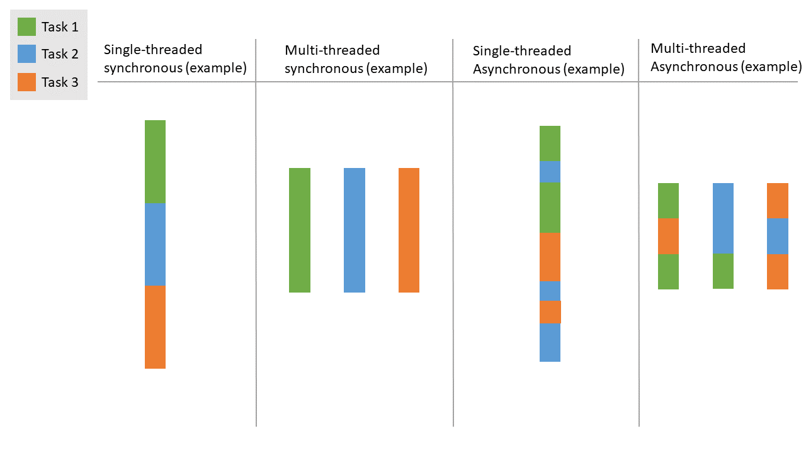

# Asynchronous & Parallel Programming

Before we get into parallel programming, it's good to define the terminology we'll use to talk about it.  Asynchronous, concurrent, and parallel execution are all related terms but have different meanings.  Explanations around the internet [vary slightly](https://stackoverflow.com/questions/4844637/what-is-the-difference-between-concurrency-parallelism-and-asynchronous-methods), but these are the most common:

- **Parallel**: multiple tasks are executed at the same time
- **Concurrent**: multiple tasks _can_ be executed at the same time, _either_ interleaved or in parallel
- **Asynchrony**: declaring something "asynchronous" means further execution does not need to wait for it to complete.  It can be one way of expressing that code _allows for_ concurrency.

Some clarifying examples:

- I can declare my code asynchronous, but my language or framework might execute it sequentially rather than concurrently.
- I can have concurrently executing tasks, but because I only have one thread of execution, they do not execute in parallel.

To help illustrate these concepts:



See also:
- [Concurrent Computing (wikipedia)](https://en.wikipedia.org/wiki/Concurrent_computing)
- [Asynchrony (wikipedia)](https://en.wikipedia.org/wiki/Asynchrony_(computer_programming))

## Threading

Let's put this into practice with Threads.

_TODO_

## CPython and the GIL

To talk about the constraints of threading in Python, it's important to talk about what Python is.  Python is a _programming language_, but Python code is executed by one of several **implementations**.  These [implementations](https://wiki.python.org/moin/PythonImplementations) include:

- **CPython**: the original, and most common implementation
- **PyPy**: Python with its own Just-In-Time (JIT) compiler
- **Jython**: Python running on the Java Virtual Machine 
- **IronPython**: Python running on the .NET CLR/DLR
 threading

You can see what implementation you're running with the following code:

```py
>>> import platform
>>> print(platform.python_implementation())
CPython
```

CPython is the one you are most likely using.  And CPython has a particular characteristic that is challenging for multithreading use cases: a **global interpreter lock** or GIL.

What does that mean?  Python is an [interpreted language](https://en.wikipedia.org/wiki/Interpreter_(computing)), which means instructions are executed without previously being compiled into machine code.  The interpreter does a lot of work in order for this to happen, and importantly, that work is not thread-safe.  Because it's not thread-safe, the interpreter must acquire a lock to make sure only one thread is executing at a time.  The net effect is that _in many cases_, Python can run threads concurrently, but not in parallel, effectively single-threading the execution of the application.

> For more than you ever wanted to know about the GIL, see [Understanding the Python GIL](http://www.dabeaz.com/GIL/)

Why "in many cases"?  The keyword in "Global Interpreter Lock" is "interpreter".  There are many tasks your computer does for a long time that does not involve interpreting Python code.  For example:

- Reading data from a large file might wait on disk
- Calling an API over the internet might wait on your network

While these operations might take a long time, they do not require the current thread to interpret any code.  They are generally called **I/O bound** operations because they [wait on I/O](https://en.wikipedia.org/wiki/I/O_bound), in contrast with **CPU bound** operations which use your computer's CPU (say, a `for` loop doing math).  Generally, I/O bound work on one thread allows other threads to continue to execute.

CPU-bound work doesn't _always_ have to lock threads, however.  Library writers can create Python code that [takes advantage of C/C++](https://docs.python.org/3/extending/extending.html) to optimize performance.  When you do that, you can control [releasing and locking the GIL](https://docs.python.org/3/c-api/init.html#releasing-the-gil-from-extension-code).

So: many libraries that perform CPU-intensive number crunching, such as [array math in `numpy`](https://scipy-cookbook.readthedocs.io/items/ParallelProgramming.html#Threads) also release the GIL during those operations.

> If the GIL in CPython is problematic, should you use a different implementation?  Beware of premature optimization, and be extremely cautious with other implementations like PyPy as [support and tooling](https://stackoverflow.com/a/18946824) may or may not meet your needs.

_TODO: Example of the GIL in action_

## Asyncio

_TODO_

See also:
- [Python Asyncio (series)](https://bbc.github.io/cloudfit-public-docs/asyncio/asyncio-part-1.html)

## Multiprocessing

_TODO_

## A Note on Performance

Premature optimization: prove it

_TODO_