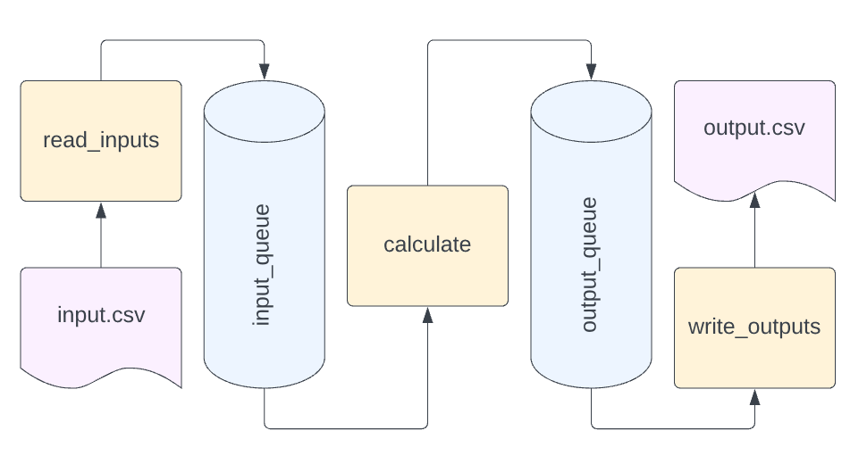

# Asynchronous & Parallel Programming

Before we get into parallel programming, it's good to define the terminology we'll use to talk about it.  Asynchronous, concurrent, and parallel execution are all related terms but have different meanings.  Explanations around the internet [vary slightly](https://stackoverflow.com/questions/4844637/what-is-the-difference-between-concurrency-parallelism-and-asynchronous-methods), but these are the most common:

- **Parallel**: multiple tasks are executed at the same time
- **Concurrent**: multiple tasks _can_ be executed at the same time, _either_ interleaved or in parallel
- **Asynchrony**: declaring something "asynchronous" means further execution does not need to wait for it to complete.  It can be one way of expressing that code _allows for_ concurrency.

Some clarifying examples:

- I can declare my code asynchronous, but my language or framework might execute it sequentially rather than concurrently.
- I can have concurrently executing tasks, but because I only have one thread of execution, they do not execute in parallel.

To help illustrate these concepts:


See also:
- [Concurrent Computing (wikipedia)](https://en.wikipedia.org/wiki/Concurrent_computing)
- [Asynchrony (wikipedia)](https://en.wikipedia.org/wiki/Asynchrony_(computer_programming))

## Threading

Let's put this into practice with threads.  A thread is a separate flow of execution in a single process.

Calculating distances between two points in a distance matrix calculator is an embarrassingly parallel problem: each distance calculation is entirely independent from the others.  So we _could_ try to maximize parallelism by dividing every calculation into its own thread.  

Open up [executors.py](../../../src/distance_matrix/executors.py) and look at the implementation of `threaded_executor`.  This implementation uses a `Queue` to gather results from multiple threads.

Next, open up [main.py](../../../src/distance_matrix/main.py), and see which executor we are using in `run`.  Note also that we are timing the execution of this function.  Try running the `distance_matrix` module like so:

```sh
python -m distance_matrix tests/integration/data/many_locations.csv
```

And observe that the time taken is printed.  Change this out for the threaded implementation like so:

```py
executor = executors.threaded_executor(calculator)
```

Run the module again.  Was it faster or slower?

Threads come with their own overhead, so putting every calculation in its own thread may not be the most efficient way of performing these calculations.

What if we tried using a fixed number of threads?  This pattern is called a **thread pool**.  There are a couple implementations in Python, but we can make a simple thread pool of our own to demonstrate how they work.  Open up [concurrency/thread_pool.py](../../../src/distance_matrix/concurrency/thread_pool.py).

Change out the executor for the threadpool implementation like so:

```py
executor = executors.threadpool_executor(calculator)
```

> Notice in the `executors` module that we declare the `_THREAD_POOL` outside the `threadpool_executor` function, so we are not including its initialization time in the performance timing.

Run the module again.  Was it faster or slower?

The threadpool is better than individual threads, but still worse than the basic implementation.  Why is that?  There is still some overhead of threading which adds time, but importantly, the work isn't being done in parallel.

> It's hard to separate the significant overhead of creating threads from the time of the work being done.  For a more apples-to-apples comparison, try changing the number of threads in the thread pool and re-running.

To understand why this is slower, we'll need to talk about...

## CPython and the GIL

To talk about the constraints of threading in Python, it's important to talk about what Python is.  Python is a _programming language_, but Python code is executed by one of several **implementations**.  These [implementations](https://wiki.python.org/moin/PythonImplementations) include:

- **CPython**: the original, and most common implementation
- **PyPy**: Python with its own Just-In-Time (JIT) compiler
- **Jython**: Python running on the Java Virtual Machine 
- **IronPython**: Python running on the .NET CLR/DLR
 threading

You can see what implementation you're running with the following code:

```py
>>> import platform
>>> print(platform.python_implementation())
CPython
```

CPython is the one you are most likely using.  And CPython has a particular characteristic that is challenging for multithreading use cases: a **global interpreter lock** or GIL.

What does that mean?  Python is an [interpreted language](https://en.wikipedia.org/wiki/Interpreter_(computing)), which means instructions are executed without previously being compiled into machine code.  The interpreter does a lot of work in order for this to happen, and importantly, that work is not thread-safe.  Because it's not thread-safe, the interpreter must acquire a lock to make sure only one thread is executing at a time.  The net effect is that _in many cases_, Python can run threads concurrently, but not in parallel, effectively single-threading the execution of the application.

> For more than you ever wanted to know about the GIL, see [Understanding the Python GIL](http://www.dabeaz.com/GIL/)

Why "in many cases"?  The keyword in "Global Interpreter Lock" is "interpreter".  There are many tasks your computer does for a long time that does not involve interpreting Python code.  For example:

- Reading data from a large file might wait on disk
- Calling an API over the internet might wait on your network

While these operations might take a long time, they do not require the current thread to interpret any code.  They are generally called **I/O bound** operations because they [wait on I/O](https://en.wikipedia.org/wiki/I/O_bound), in contrast with **CPU bound** operations which use your computer's CPU (say, a `for` loop doing math).  Generally, I/O bound work on one thread allows other threads to continue to execute.

CPU-bound work doesn't _always_ have to lock threads, however.  Library writers can create Python code that [takes advantage of C/C++](https://docs.python.org/3/extending/extending.html) to optimize performance.  When you do that, you can control [releasing and locking the GIL](https://docs.python.org/3/c-api/init.html#releasing-the-gil-from-extension-code).

So: many libraries that perform CPU-intensive number crunching, such as [array math in `numpy`](https://scipy-cookbook.readthedocs.io/items/ParallelProgramming.html#Threads) also release the GIL during those operations.

> If the GIL in CPython is problematic, should you use a different implementation?  Beware of premature optimization, and be extremely cautious with other implementations like PyPy as [support and tooling](https://stackoverflow.com/a/18946824) may or may not meet your needs.

Another function that releases the GIL is `time.sleep()` (after all, if one thread sleeps, other threads can do work).

To see this in action, take a look at [gil.py](../gil.py) in this topic.  Run it with:

```sh
python docs/module-3/gil.py
```

Note how it takes 1s to run rather than 5s, indicating that sleep does not wait.  If we replaced `time.sleep` with 1s worth of CPU-bound work, the script would take 5s to run instead.

## Asyncio

The `async` and `await` keywords are essentially ways of denoting code _can_ be executed concurrently in an application.  You might often see the word **coroutine** to denote async functions: this is in contrast with **subroutine** (I.E.: a normal function).  They are most often run using `asyncio`, which is a built-in framework for executing coroutines.

`asyncio` does not magically make the GIL issues above go away!  We just discussed previously how I/O-bound operations don't lock the GIL.  Using `asyncio` along with `asyncio` libraries just introduces a different mechanism of navigating around I/O bound operations -- using cooperative multitasking instead of threads.

Let's see how this works in practice.  Our distance matrix library is based around file I/O, which should be perfect to demonstrate something I/O bound, right?  Except...

File I/O actually isn't a great example.  While there are libraries to work with files using `async` functions (like `aiofiles`), they can often end up being slower than their synchronous counterparts.  See the [asyncio wiki](https://github.com/python/asyncio/wiki/ThirdParty#filesystem) and [this StackOverflow answer](https://stackoverflow.com/a/60030750) for more on why.

So instead in this demo, we're going to fake some I/O bound work.  But first, let's look at some of the async code in our distance matrix calculator.  Open up [main.py](../../../src/distance_matrix/main.py), and see how we're calling `async_runner.run` if the `asyncio` arg is provided.  Try running the distance matrix calculator in two ways:

```sh
python -m distance_matrix tests/integration/data/five_locations.csv
python -m distance_matrix tests/integration/data/five_locations.csv --asyncio
```

The `asyncio` version should take slightly longer to run, as we haven't introduced any fake I/O-bound work.  Let's look at the implementation in [async_runner.py](../../../src/distance_matrix/async_runner.py):

```py
async def run(path: str) -> None:
    input_queue: AsyncQueueProtocol[Location] = Queue()
    output_queue: AsyncQueueProtocol[Output] = Queue()

    input_task = asyncio.create_task(_read_inputs_task(input_queue, path))
    _ = asyncio.create_task(_calculate_task(input_queue, output_queue))
    _ = asyncio.create_task(_write_task(output_queue, path))

    await input_task
    await input_queue.join()
    await output_queue.join()
```

This function is implemented using a producer-consumer queue design.  There are three asynchronous tasks, separated by queues:



Because each task is marked `async`, at any given time it may yield execution to a different task.  If we pretend reading inputs or writing outputs (or both) is I/O bound work, we can see how this is beneficial.  While waiting on the next input row, for example, we can use the CPU to perform a distance matrix calculation, or initiate a write.

Let's introduce our fake work. in both [inputs.py](../../../src/distance_matrix/inputs.py) and [outputs.py](../../../src/distance_matrix/outputs.py):
- import both `time` and `asyncio`
- in the synchronous function, add `time.sleep(0.5)` within the `for` loop
- in the asynchronous function, add `await asyncio.sleep(0.5)` within the `async for` loop

This pretends we have half a second of I/O work per row both reading and writing.  Now let's run the application again.

```sh
python -m distance_matrix tests/integration/data/five_locations.csv
python -m distance_matrix tests/integration/data/five_locations.csv --asyncio
```

Which is faster now?

> If you want to see the order of execution, try adding `print("read")` and `print("write")` statements next to the sleeps for both sync and async.  The major time saver is that the read and write "work" can happen at the same time.

### Asyncio and Testing 

Take a look at the [test_distance_matrix.py](../../../tests/integration/test_distance_matrix.py) integration tests.  Note how we're using a special `@pytest.mark.asyncio` decorator to tell `pytest` that tests should be run asynchronously.

See the `pytest-asyncio` library ([GitHub](https://github.com/pytest-dev/pytest-asyncio)) for more details on that extension.

See also:
- [Python Asyncio (series)](https://bbc.github.io/cloudfit-public-docs/asyncio/asyncio-part-1.html)

## Multiprocessing

_TODO_

## Wrapping Up

We introduced a number of concepts for concurrency in Python.  A good rule of thumb is:

- If your work is I/O bound (HTTP calls, database calls, etc.), consider `asyncio`
- If your work is CPU bound (number crunching, object manipulation, etc.), consider `multiprocessing`

In the next topic, we'll dive into other libraries used for fast number crunching, and learn what makes them tick.

### Performance Optimization

One final note.  Premature optimization: prove it

_TODO_