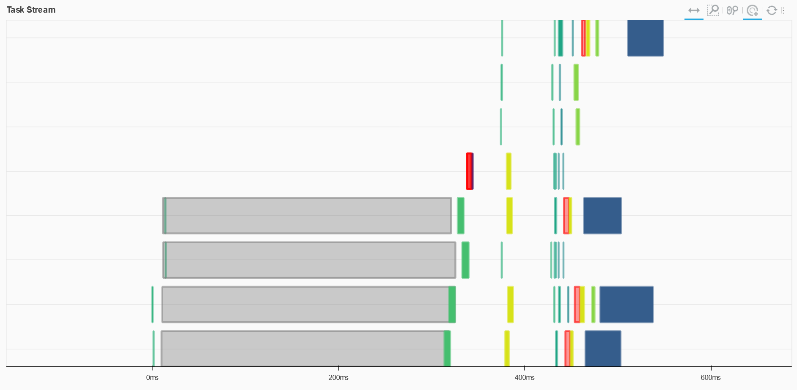

# Pandas Best Practices

In all of the previous examples, we've talked about parallelization and concurrency for basic Python code.  But when performing calculations across many data points, there are two libraries we can use for simpler data-driven operations and better performance: `numpy` ([GitHub](https://github.com/numpy/numpy)) and `pandas` ([GitHub](https://github.com/pandas-dev/pandas)).

## Under The Hood: Vectorization

Under the hood, these libraries leverage a programming technique called **vectorization**.  Also known as array programming ([wiki](https://en.wikipedia.org/wiki/Array_programming)), vectorization allows you to apply operations to entire vectors or matrices of values much faster than iterating over those values individually.  They can also be more memory-efficient.

We can demonstrate this fairly easily.  First, let's install `numpy` (if not already installed):

```sh
pip install numpy
```

Then, in an interpreter, let's compare a vectorized operation with a simple `for` loop:

```py
>>> import numpy as np
>>> from timeit import timeit
>>> def total():
...     total = 0
...     for i in range(10000):
...         total += 1
...     return total
...
>>> timeit(total, number=1000)
0.42119919999999667
>>> def total():
...     return np.sum(np.arange(10000))
...
>>> timeit(total, number=1000)
0.018799099999966984
```

We can apply these functions to our distance matrix calculator.  Whereas our current calculator signature is designed to work on a single pair of coordinates at a time, our `numpy`-driven calculator will work on vectors.

Take a look at the logic in [pandas_runner.py](../../../src/distance_matrix/pandas_runner.py).  Compare the `numpy`-driven `haversine` function to the equivalent in [calculators.py](../../../src/distance_matrix/calculators.py).  It's essentially the same, except we're operating on arrays rather than individual rows.

Let's run our different methods and compare times:

```py
python -m distance_matrix tests/integration/data/five_locations.csv
python -m distance_matrix tests/integration/data/five_locations.csv -r pandas
```

Try this with differently sized data sets:

- five_locations.csv
- many_locations.csv
- 1k_locations.csv

Notice how the calculation times compare.  There is overhead to using `pandas`, but it can be much faster on larger data sets.

## Pandas Best Practices

The following tips are mainly summarized from [Modern Pandas series by Tom Augspurger](https://tomaugspurger.github.io/modern-1-intro) (a `pandas` maintainer):

- **Style**:
  - **Method Chaining**: method chaining is the practice of chaining together functions in `pandas` (that style is used in this workshop).  Generally it's a matter of personal preference, but if you do, be aware of `DataFrame.pipe` ([docs](https://pandas.pydata.org/docs/reference/api/pandas.DataFrame.pipe.html)).
  - **Avoid Inplace**: most `pandas` functions have the ability to execute `inplace`.  You might think it saves on copying / memory, but in practice it often does not. 
- **Performance**:
  - **Vectorize**: As we saw previously, there is a marked difference in performance between iterating data and vectorized operations.  Prefer vectorized operations to iterating with `for` or ``DataFrame.apply`.
  - **Datatypes**: Prefer using numeric `dtype` columns for numeric fields to get the most of of `numpy` optimizations.  You can check the `dtype` of your columns with `DataFrame.dtypes` (also take advantage of [categoricals](https://pandas.pydata.org/pandas-docs/version/0.18.0/categorical.html) for enum-like values).


## Recommended Dependencies

_TODO_

Note that we're also using the `pandas-stubs` library ([GitHub](https://github.com/VirtusLab/pandas-stubs)) to provide type checking stubs for `pandas`.

> Note: stub libraries aren't perfect, and `pandas-stubs` has a lot of ground to cover.  If you have a keen eye, you might have spotted that our code is working around an [open typing issue](https://github.com/VirtusLab/pandas-stubs/issues/170) with `read_csv`.

See also: [Pandas Recommended Dependencies](https://pandas.pydata.org/docs/getting_started/install.html#recommended-dependencies)

## Dask

In the parallelization topic, we saw how to use different techniques in Python to take advantage of multiple cores.  Can we go bigger?

There are [many frameworks in Python](https://wiki.python.org/moin/ParallelProcessing) to scale out computation to multiple nodes in a computing cluster.  We won't cover general-purpose solutions, but rather focus on one in particular in the `numpy` / `pandas` ecosystem: **Dask**.

Dask ([GitHub](https://github.com/dask/dask)) is a library for distributed computing, built to have a similar interface as `numpy`, `pandas`, and others.  It can run locally, scaling on a single machine, or deployed in a cluster of nodes via a [mechanism like](https://blog.dask.org/2020/07/23/current-state-of-distributed-dask-clusters) Kubernetes, AWS Fargate, or HPC job managers.

To get started with `dask`, you'll need both `dask` and the `distributed` package (if not already installed):

```sh
pip install dask[distributed]
```

Take a look at [dask_runner.py](../../../src/distance_matrix/dask_runner.py).  Notice that it's mostly the same as the `pandas` runner with a few differences:

- The `pandas` dataframe is converted to a `dask` dataframe midway through processing, with 4 partitions
- The outputs are defined as writing to `"output/*.csv"` files rather than a single file
- We are initializing a `dask` cluster, and there are a couple `input` statements to introduce pauses

Go ahead and run the application with the `dask` runner. When it prompts you for input, navigate to the provided dashboard link:

```sh
python -m distance_matrix tests/integration/data/many_locations.csv -r dask
Press enter to continue, see dashboard at http://127.0.0.1:8787/status
```

With the dashboard open, go back to your terminal and press enter.  Observe that `dask` creates a performance dashboard of all the executed workers, including which steps took how much time:



Press enter again to complete the program.  Navigate to the created [output](../../../tests/integration/data/output/) folder under integration tests, and observe that there are 4 `csv` files numbered 0-3.

> While we won't cover the features `dask` has to deploy across compute clusters, hopefully that gives you a flavor of how it can help scale out `pandas` and `numpy` driven workloads.